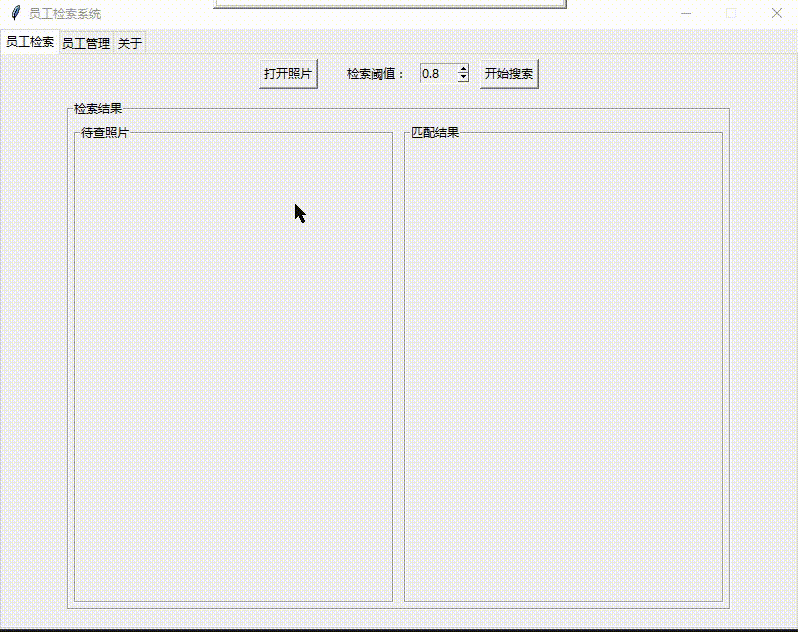

# 基于深度学习方法的人脸检索系统

## 0 项目来源
 
今年8月我入职我司的信息系统部门，我司要求新员工必须要跨部门轮岗实习，我被分配到了人事。人事的带教老师听说我是搞人工智能的，提出了需求：判断一张照片中的人是不是我司的员工。这个需求和我在学校做的工作类似，感觉难度不大，所以答应下来。此项目一来可以作为一个工具供人事部门使用，二来也可以作为轮岗实习的项目成果。

## 1 开发历程

人脸检索主要分为三个步骤：人脸检测、特征提取和特征检索。人脸检测方法采用的是MTCNN网络；人脸特征提取一开始准备使用VGG-FACE的，但是VGG-FACE的fc7层的向量维度是4096维的，维度太大不利于后续的检索，而且之前做毕业论文时把fc7层修改成512维的VGG-FACE网络找不到了，所以VGG-FACE就被抛弃了，后来查到Google的facenet不错，就选用facenet了；整个公司大概三万五千人，不需要特别的检索算法，使用穷尽搜索就OK了，速度慢是慢点但是准确率高。

一开始准备使用深度学习框架是caffe，毕竟在学校的时候接触的比较多，使用起来也顺手。但是！公司的电脑不便于安装软件，我没有管理员权限，无法安装需要管理员权限的软件。Windows下caffe的安装需要vs2015，而vs2015对公司是收费的。所以各种原因使我抛弃了caffe投入TensorFlow的怀抱。由于电脑上没有GPU显卡，所以使用的是TensorFlow的CPU版本。

开发语言选择的是Python，遵从TensorFlow的建议使用Python3.6.2。软件是个人PC单独使用的，所以UI和服务做成一个整体。UI直接所以Python内置的tkinter，虽然功能不如其他框架完善但是做一个小工具已经足够了。数据库方面使用SQLite数据库，使用简单，开发快速。

项目整体开发时间大概三个星期，前两个星期完成了基本功能，后一个星期做一些界面和操作上的优化。所谓前人种树后人乘凉，此项目的代码也不全是我写的，很多代码都是参考和使用其他项目的代码完成的，具体的在Reference中。

## 2 关键技术

### TensorFlow

Google的东西就是香！[TensorFlow](https://www.tensorflow.org/)

### MTCNN

[MTCNN](https://github.com/AITTSMD/MTCNN-Tensorflow)用于人脸检测和对齐，在理论和实践中都表现出较好的效果，直接拿来用就好了！

### facenet

Google的东西还是香！[facenet](https://github.com/davidsandberg/facenet)
网上都说facenet提取的特征是128维的，但是实际上代码跑出来的特征向量是512维的，可能是模型更新了。

## 3 项目结构

该系统分为前端后后端两部分，前端主要用于绘制UI界面和发送数据，后端主要用于处理图片数据。

### 前端

前端用于绘制UI界面和控制数据逻辑。前端将数据传给中间件，中间件对数据进行整理后发送给后端，后端接收到数据后进行计算或者存储处理，然后将处理结果发送给中间件，中间件将结果数据进行整理后发送给前端进行展示。

### 后端

后端用于进行人脸检测、特征提取、特征检索和数据库操作。人脸检测时返回的是图片中的所有人脸位置信息，具体是对使用人脸进行操作还是只对某一个人脸进行操作由中间件决定。特征提取是对中间件发送来的人脸数据进行操作的，返回的特征是512的特征向量。特征检索时将待查特征向量与数据库中的所有特征向量进行余弦相似度计算，然后根据设定的阈值返回结果。数据库操作包括对人脸相关信息的增删改查。

## 4 项目成果

经过三个星期的开发，此项目终于完成了，得益于MTCNN和facenet优秀的算法，程序使用过程中基本上没什么大问题。人脸检测方面没有什么问题，所有人脸都能检测出来；检索方面，虽然检索结果中相似度最大的第一名不一定是正确结果，但是Top-10中一定会出现正确结果；检索速度方面，对于22000个人脸的数据库，单张图片的检索时间为50秒左右，没有实时性要求的话该速度可以接受。在进行批量添加时，每一张图片的处理时间为1.5秒左右，22000张图片大概耗时12小时。

## 5 优化方向

- 优化检索算法，减少检索等待时间；
- 多张人脸照片入库，减小检索误差；
- 使用GPU加速。

## 6 小结

通过本次开发熟悉了Python中的tkinter使用，了解了tensorflow框架下MTCNN和facenet的使用方法。虽然核心算法部分不是自己实现的，但是依然收获颇多，不论是编程能力方面还是算法理解方面都有进一步的提高。该项目中的系统还有很大的优化空间，如果继续开发的话还是能够更加完善的。

## 7 Reference

- [Real Time Face Recognition](https://github.com/shanren7/real_time_face_recognition)
- [MTCNN](https://github.com/AITTSMD/MTCNN-Tensorflow)
- [facenet](https://github.com/davidsandberg/facenet)
- [TensorFlow](https://www.tensorflow.org/)
- [SQLite](https://www.cndba.cn/dave/article/2154)