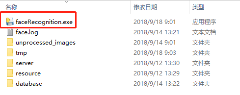
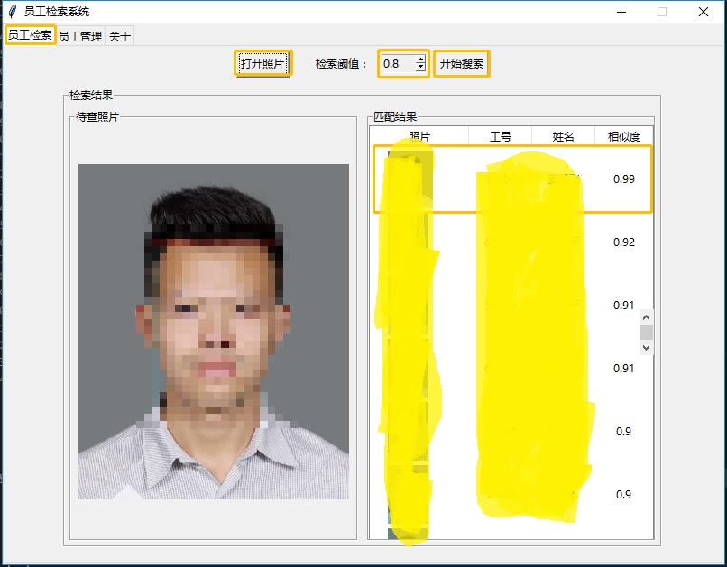
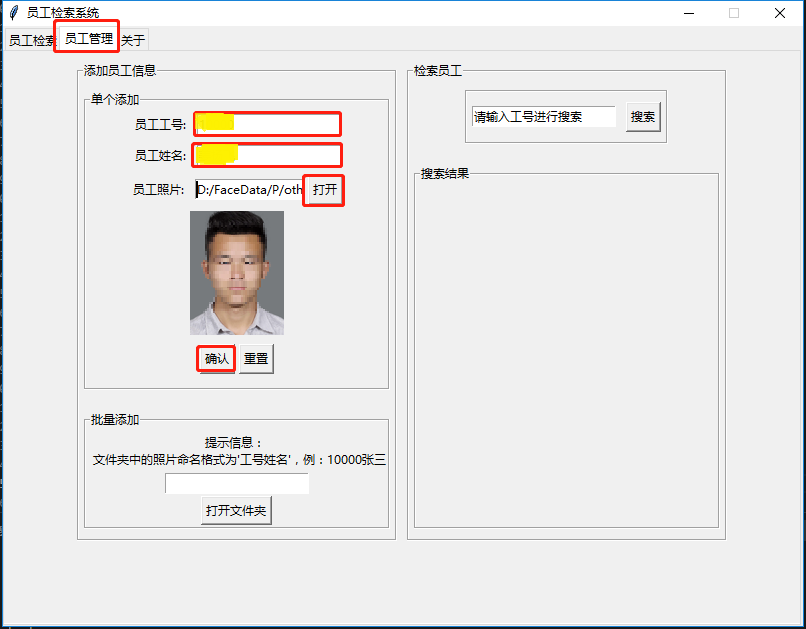
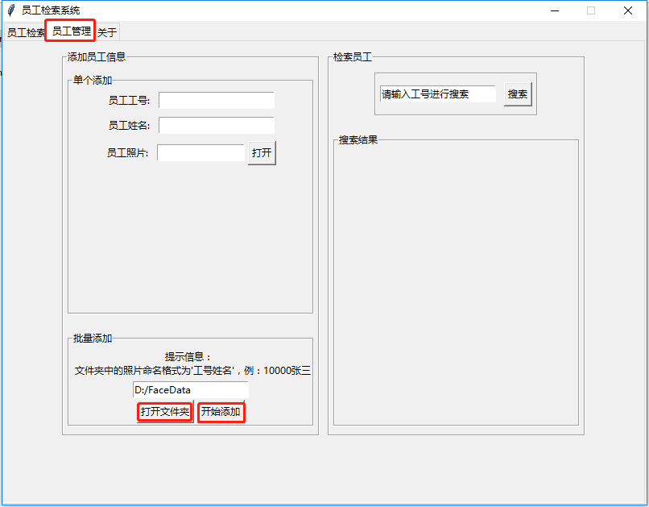
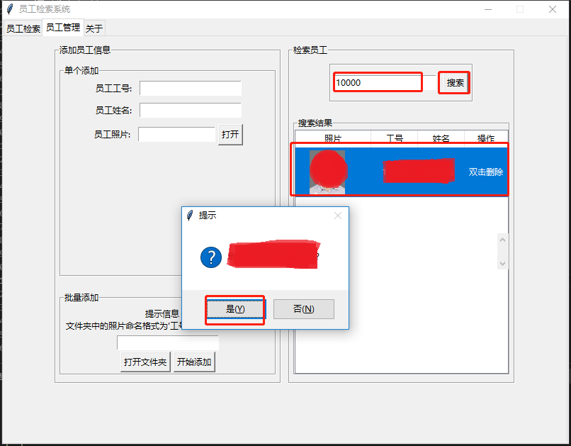

# 员工照片检索系统使用说明

## 运行环境

Windows10 64bit

## 版本

20180918-V0.1.3

## 软件目录结构

```shell
faceRecognition
|
├─faceRecognition.exe -----可执行文件
├─face.log ----------------日志文件
├─database
|  ├─face.db --------------数据库文件
│  └─images ---------------保存照片文件夹
├─resource ----------------资源文件夹
├─server ------------------神经网络模型文件夹
├─tmp ---------------------临时文件夹
└─unprocessed_images ------自动扫描处理文件夹
```

## 使用说明

### 1. 启动。解压压缩包后双击"faceRecognition.exe"启动。



### 2. 检索。启动后即进入检索界面，检索步骤：

- 打开图片文件（必须为JPG格式文件）；
- 设定阈值（默认为0.8）；
- 开始检索；
- 查看结果。



### 3. 员工管理。点击“员工管理”即可进入管理界面

#### 单个添加

单个添加员工步骤：

- 填写员工工号；
- 填写员工姓名；
- 打开员工照片；
- 点击开始按钮。



#### 批量添加

批量添加员工步骤：

- 打开照片所在文件夹；
- 开始添加。



#### 员工查找与删除

查找员工步骤:

- 输入工号；
- 点击搜索按钮。

删除员工步骤：

- 输入工号查找待删除员工；
- 双击员工信息所在行。



## Q&A

Q: 检索结果是不是一定正确？  
A: 检索结果不一定正确，结果仅供参考，最后还需要人为判断。

Q: 软件不能启动？  
A: 请检查软件所需要的文件是否完整。

Q: 每一次检索时间是多久？  
A: 数据库中包含23000张图片时，检索时间大约50秒。

Q: 需要更新员工的照片时如何操作？  
A: 更新员工照片只需要重新进行一次“单个添加”操作就行了。

Q: 批量添加时有何要求？  
A: 批量添加时要求文件夹中的照片都是以“工号”或者“工号姓名”格式命名的jpg文件，否则不能添加。

Q: 检索时照片中有多个人脸如何处理？  
A: 照片中包含多个人脸时，软件会对最大的那个人脸进行检索。